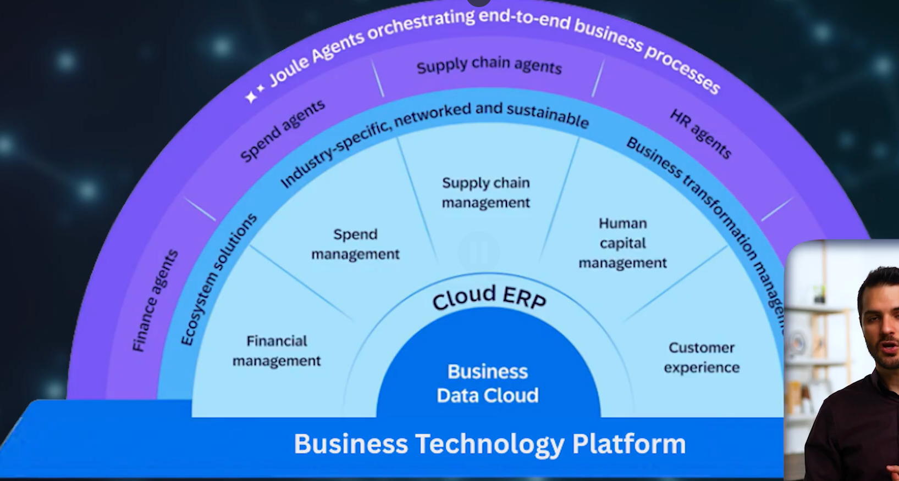

# The actual BTP environment
- Eventually we will log into something called the SAP BTP Cockpit, we can think of it like as a control center. A companys BTP landscape could be organized roughly like:

Company
│
└── GLOBAL ACCOUNT
      │
      ├── Subaccount: Development
      │       │
      │       ├── Applications
      │       ├── Services
      │       └── Runtime
      │
      ├── Subaccount: Testing
      │
      │
      └── Subaccount: Production

- A global-account is the top-level account representing the organizations BTP resources, inside of it are subaccounts.
- Subaccounts are where applications are deployed, services are used, subscriptions are managed, etc. Each subaccount also belongs to a specific gepgraphic region. 

---

## Cloud Foundry & Kyma
- These are runtime environments where application can actually run.

#### Cloud Foundry
- A managed platform for deploying applications written in various languages
SAP BTP
   ↓
Cloud Foundry
   ↓
Your running Java application

#### Kyma
- Kyma is based on kubernetes, so if a company wants a more container-oriented architeccture. 

---

- Through this graphic we can see what we have been learning, the fact that we have these differnet components:

1. First the main ERP (Cloud ERP) which is S/4HANA and then that is sitting on top of the Business Data Cloud (i.e. the HANA database)

2. Then that main ERP is split into the different business areas and requirements and then on top of that we have the AI capabilities that come from Joule Agents and stuff.

3. And then at the bottom we see that everything is sitting on BTP --> Where the easiest way to describe it is that it is the platform that allows everything to integrate together with each other.

- Again the main responsibility and selling point of BTP is the fact that it is very easy to integrate and bring in external apps and other things in with the main ERP that many companies have which is something like an S/4HANA

